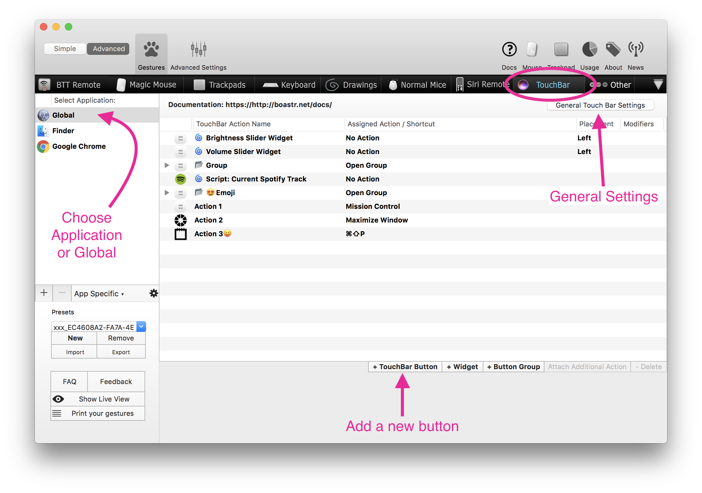

# BetterTouchTool Touch Bar 
BetterTouchTool allows you to completely customize the Touch Bar for any application. This chapter describes how to do that.
* [Touch Bar: Basics](touch_bar_basics.md)
* [Touch Bar Widgets](touch_bar_widgets.md)
* [Touch Bar Advanced Configuration](touch_bar_advanced.md)

**Please go to [https://github.com/fifafu/BetterTouchTool](https://github.com/fifafu/BetterTouchTool) to report issues or ask questions.**

