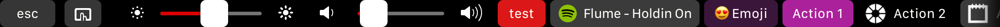
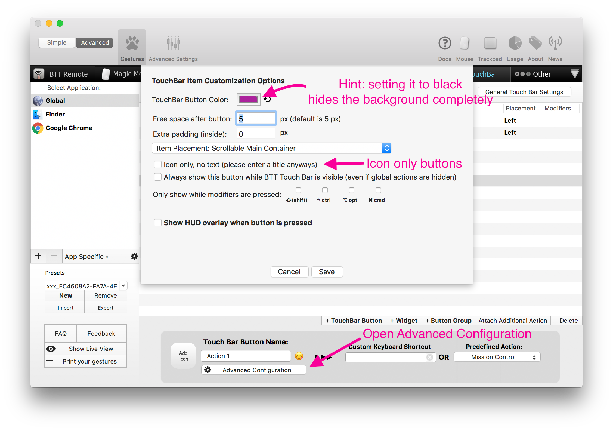
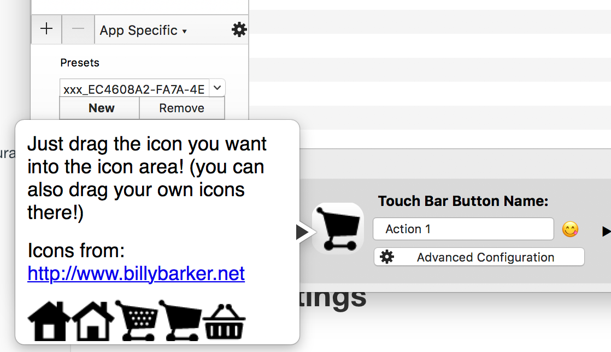
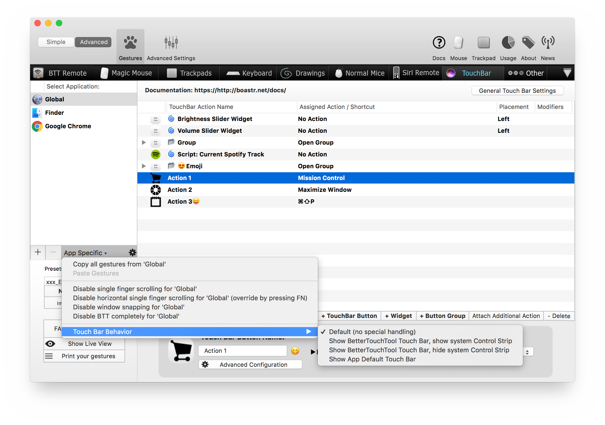
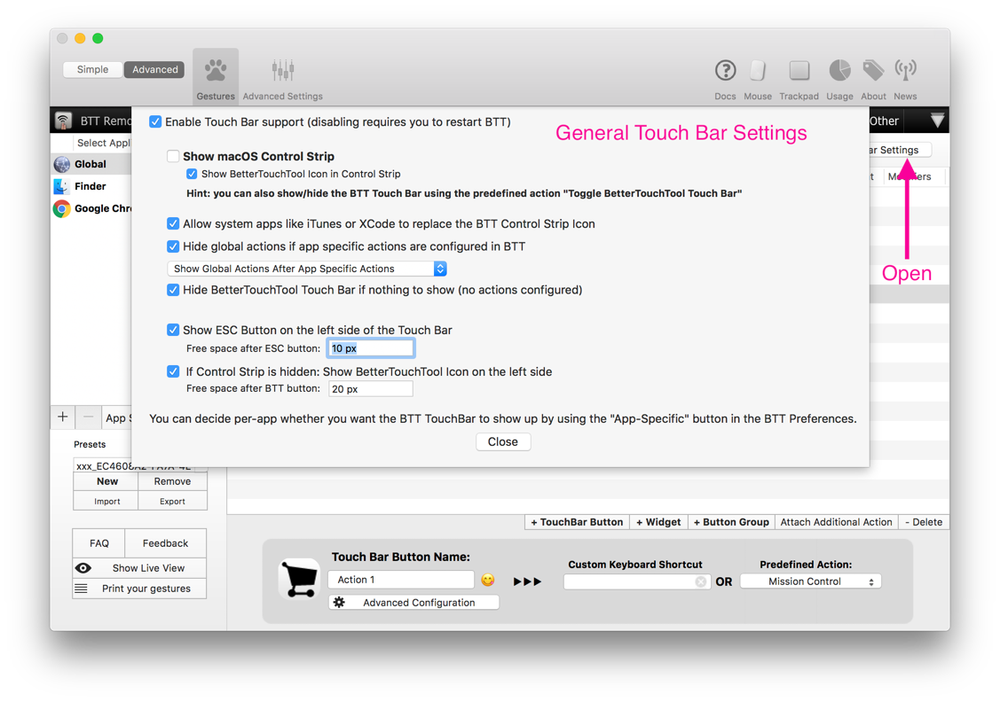

# Touch Bar
BetterTouchTool let's you customize your Touch Bar for any app you have installed.

**Note: this is still very new, please expect bugs and report them! Also I can not guarantee it will work in the future as it is not officially supported by the system.**

**Please go to [https://github.com/fifafu/BetterTouchTool](https://github.com/fifafu/BetterTouchTool) to report issues or ask questions.**

## Known Limitations
* The only way to get rid of the x icon on the left side of the Touch Bar is to disable "Show macOS Control Strip" in the General Touch Bar settings in BTT
* When hiding the Touch Bar with the x button on the left, it will require tapping the BTT icon in the Control Strip twice to get it back.
* You can not partially customize an app's Touch Bar. You can only replace it completely using BTT:

## Adding New TouchBar Buttons

* Decide whether you want to show your Touch Bar button globally or just for one specific application. Select accordingly in the application list on the very left of the BTT Preferences.
* Click the "Add TouchBar" button in the TouchBar tab
* Enter a name (that's required for it to show up in the Touch Bar)
* Assign any action or shortcut you want.

## Customizing the Touch Bar Button Appearance

* To customize the appearance of the configured Touch Bar buttons, click the little gear icon.

* You can also add icons to your Touch Bar buttons. Just drag your own icons onto the "Add Icon" area, or click that area and choose one of the provided icons and drag it onto the area.

## App Specific Configuration
* For any app you can choose whether you want to show the BTT Touch Bar or rather show the app's default bar.

## General Settings

* You can decide if you want to show the Control Strip on the right side of the Touch Bar, or if you want to have more space available for your buttons and don't show it. (Hint: you can configure your Control Strip in System Preferences => Keyboard => Customize Control Strip)
* You can decide whether to show the BetterTouchTool icon in the Control Strip. (If you don't show it, you have to use the predefined action "Toggle BetterTouchTool Touch Bar" to show or hide the BTT Touch Bar.)
* You can decide whether you want to Show the global actions also if app-specific actions are available. Hint: by long pressing the BTT icon you can force it to only show the global actions regardless of this setting.

