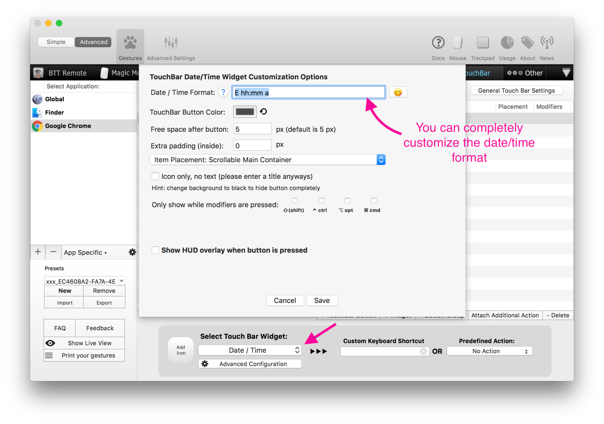
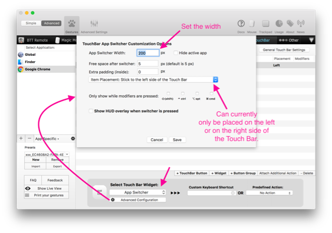
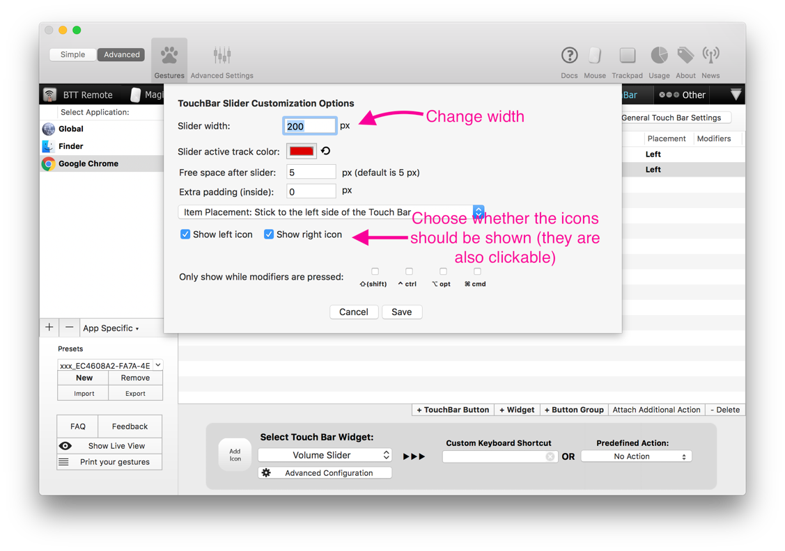
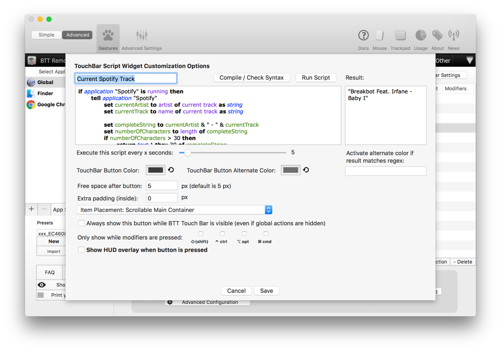

# Touch Bar Widgets
BetterTouchTool includes some widgets you can display on your Touch Bar.

**Hint:** It is often useful to put the widgets inside a Touch Bar Group
## Remaining Battery Widgets
This Widget allows you to view the estimated remaining time your Macbook Pro can run on the current battery charge.

## Date / Time Widget
Shows the current date/time in any format you want.

## App Switcher Widgets
Allows you to switch through your recent applications (like pressing cmd+tab)

## Volume Slider
Adjust the Mac speaker volume using a slider

## Brightness Slider
Adjust the Mac's brightness using a slider. 

**If you press ctrl while sliding it will change the brightness of your external monitors**

## Apple Script Widget
Allows you to run aribtrary Apple Script in a customizable time interval and display the result in the Touch Bar.

This is a very powerful widget, one example is the ability to show the currently playing Spotify Song (see [https://github.com/fifafu/BetterTouchTool/issues/308](https://github.com/fifafu/BetterTouchTool/issues/308))

## Emoji Widget
Allows you to insert emoticons from your Touch Bar in any app. 

Switch between the different groups of emoji using the arrow buttons.
The first group that is shown displays the most recently used emoji.

